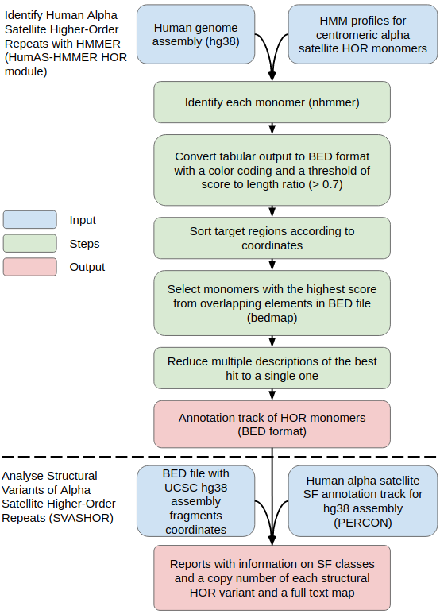

# HumAS-HMMER
Generates monomeric annotation of high order repeats of human alpha satellites.



## Prerequisites
The pipeline requires the following components:
* awk, sed, and other standard unix command-line programs;
* nhmmer from [HMMER](http://hmmer.org/);
* HMM profiles of alpha satellite HOR monomers, for example [AS-SF-HORs-SF1-divergent-hmmer3.0.hmm](https:/github.com/enigene/Files-and-scripts-used-in-SF1-HORs-in-hg38-article/HMM-profiles/AS-SF-HORs-SF1-divergent-hmmer3.0.hmm);
* [bedmap](https://bedops.readthedocs.io/en/latest/content/reference/statistics/bedmap.html);
* [hmmertblout2bed](https://github.com/enigene/hmmertblout2bed).

## Input
Any sequence in which you would like to analyze alpha satellite HORs in FASTA format:
* genomic assemblies or long contigs — to view structural HOR variants, or
* short read runs from SRA — to count monomers.

## Run Slurm job
To run this job, first modify any required slurm settings in the associated slurm file,
second you probably need to change match pattern `files=( $(find "$dir" -name "*.fasta" -print) )`
in both hmmer-array.slurm and slurm-hmmer-submit.sh files, and a path to the hmmertblout2bed script,
and then run sbatch with that slurm submission script:
```
sbatch slurm-hmmer-submit.sh /path/to/input/directory /path/and/name/of/the/profile.hmm
```

## Run local job
To run this job, you probably need to change match pattern
`files=( $(find "$dir" -name "*.fasta" -print) )` in hmmer-run.sh file, and a path
to the hmmertblout2bed script, and then run script:
```
hmmer-run.sh /path/to/input/directory /path/and/name/of/the/profile.hmm
```

## Output
Pipeline produces the tab delimited BED format file containing one feature of interest per line.
If you processing genome assembly the annotation can be viewed as
UCSC Genome Browser custom track, for example [SF1 Alpha Satellite HORs in hg38](https://genome.ucsc.edu/cgi-bin/hgTracks?db=hg38&hgt.customText=https://www.dropbox.com/s/9vuqjf87r08m4ve/nhmmer-AS-SF-HORs-SF1-divergent-hmmer3.0-vs-GCA_000001405.15_GRCh38_genomic_acc2chr-tbl-UCSCnames-t281.bed?dl=1).

## Reports
* For long contigs and assemblies you can generate reports with Structural Variants of Alpha Satellite Higher-Order Repeats via [SVASHOR](https://github.com/enigene/SVASHOR).
* For short reads you can collect stats from BED files via [bed-HOR-stats](https://github.com/enigene/bed-HOR-stats).

